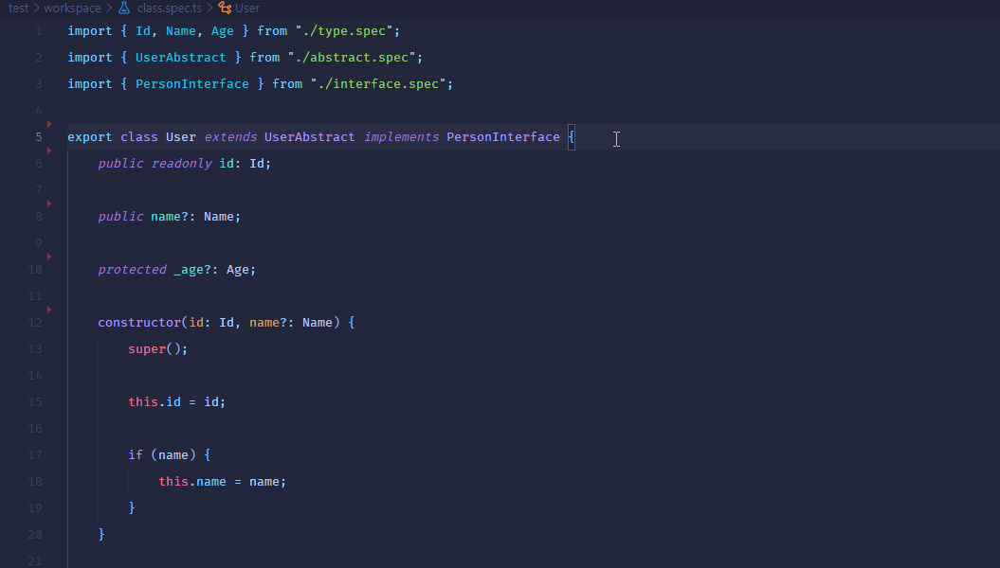

# DocTypes

**JSDoc** generator for _JavaScript_, _TypeScript_ using **AI**.



---

## Sample

-   Class

```typescript
/**
 * Exporting the class User, which extends the class UserAbstract
 * and implements the interface PersonInterface.
 *
 * @class
 * @name User
 * @kind class
 * @extends UserAbstract
 * @implements PersonInterface
 * @exports
 */
export class User extends UserAbstract implements PersonInterface {}
```

-   Function

```typescript
/**
 * Exporting a function called `createUserId` that takes a parameter called `nonce`
 * that is a number and returns a value of type `Id`.
 *
 * @function
 * @name createUserId
 * @kind function
 * @param {number} nonce?
 * @returns {Id}
 * @exports
 */
export function createUserId(nonce: number = 0): Id {}
```

-   Variable

```typescript
/**
 * Generating a random number between the `MAX` and `MIN` variables.
 *
 * @constant
 * @name perfix
 * @kind variable
 * @memberof createUserId
 * @type {number}
 */
const perfix: number = Math.floor(Math.random() * (MAX - MIN)) + MIN;
```

-   Interface

```typescript
/**
 * Exporting the interface.
 *
 * @interface
 * @name PersonInterface
 * @kind interface
 * @exports
 */
export interface PersonInterface {}
```

-   Type

```typescript
/**
 * It's a type alias.
 *
 * @typedef
 * @name Id
 * @kind variable
 * @exports
 */
export type Id = string | number;
```

---

## Shortcut keys

-   linux `ctrl+alt+d`
-   windows `ctrl+alt+d`
-   mac `cmd+alt+d`

---

## Configuration

| **Name**                                                                                                                                                                              | **Type**                                                                        |
| :------------------------------------------------------------------------------------------------------------------------------------------------------------------------------------ | :------------------------------------------------------------------------------ |
| **doctypes.mintlifyUserId**</br>The custom Mintlify <small>`userId`</small>, See [Mintlify](https://www.mintlify.com/) for more details.                                              | String</br>Default <small>`"4aeafe05-c396-4389-8d77-52e585e41932"`</small>      |
| **doctypes.mintlifyContext**</br>Type of Mintlify <small>`context`</small> full of page or single line.                                                                               | Enum <small>_Full_ , _Single_</small></br>Default <small>`Full`</small>         |
| **doctypes.descriptionWrap**</br>When the <small>`description`</small> generation type is set to <small>`Auto`</small>, the description will be split into lines based on this value. | Number</br>Default <small>`120`</small>                                         |
| **doctypes.description**</br>Type of <small>`description`</small> generation.                                                                                                         | Enum <small>_Auto_ , _Manual_ , _Off_</small></br>Default <small>`Auto`</small> |
| **doctypes.class**</br>Type of <small>`@class`</small> tag generation.                                                                                                                | Enum <small>_Auto_ , _Off_</small></br>Default <small>`Auto`</small>            |
| **doctypes.abstract**</br>Type of <small>`@abstract`</small> tag generation.                                                                                                          | Enum <small>_Auto_ , _Off_</small></br>Default <small>`Auto`</small>            |
| **doctypes.interface**</br>Type of <small>`@interface`</small> tag generation.                                                                                                        | Enum <small>_Auto_ , _Off_</small></br>Default <small>`Auto`</small>            |
| **doctypes.typedef**</br>Type of <small>`@typedef`</small> tag generation.                                                                                                            | Enum <small>_Auto_ , _Off_</small></br>Default <small>`Auto`</small>            |
| **doctypes.enum**</br>Type of <small>`@enum`</small> tag generation.                                                                                                                  | Enum <small>_Auto_ , _Off_</small></br>Default <small>`Auto`</small>            |
| **doctypes.async**</br>Type of <small>`@async`</small> tag generation.                                                                                                                | Enum <small>_Auto_ , _Off_</small></br>Default <small>`Auto`</small>            |
| **doctypes.function**</br>Type of <small>`@function`</small> tag generation.                                                                                                          | Enum <small>_Auto_ , _Off_</small></br>Default <small>`Auto`</small>            |
| **doctypes.variable**</br>Type of <small>`@variable`</small> tag generation.                                                                                                          | Enum <small>_Auto_ , _Off_</small></br>Default <small>`Auto`</small>            |
| **doctypes.name**</br>Type of <small>`@name`</small> tag generation.                                                                                                                  | Enum <small>_Auto_ , _Off_</small></br>Default <small>`Auto`</small>            |
| **doctypes.kind**</br>Type of <small>`@kind`</small> tag generation.                                                                                                                  | Enum <small>_Auto_ , _Off_</small></br>Default <small>`Auto`</small>            |
| **doctypes.memberof**</br>Type of <small>`@memberof`</small> tag generation.                                                                                                          | Enum <small>_Auto_ , _Off_</small></br>Default <small>`Auto`</small>            |
| **doctypes.public**</br>Type of <small>`@public`</small> tag generation.                                                                                                              | Enum <small>_Auto_ , _Off_</small></br>Default <small>`Auto`</small>            |
| **doctypes.private**</br>Type of <small>`@private`</small> tag generation.                                                                                                            | Enum <small>_Auto_ , _Off_</small></br>Default <small>`Auto`</small>            |
| **doctypes.protected**</br>Type of <small>`@protected`</small> tag generation.                                                                                                        | Enum <small>_Auto_ , _Off_</small></br>Default <small>`Auto`</small>            |
| **doctypes.readonly**</br>Type of <small>`@readonly`</small> tag generation.                                                                                                          | Enum <small>_Auto_ , _Off_</small></br>Default <small>`Auto`</small>            |
| **doctypes.instance**</br>Type of <small>`@instance`</small> tag generation.                                                                                                          | Enum <small>_Auto_ , _Off_</small></br>Default <small>`Auto`</small>            |
| **doctypes.type**</br>Type of <small>`@type`</small> tag generation.                                                                                                                  | Enum <small>_Auto_ , _Off_</small></br>Default <small>`Auto`</small>            |
| **doctypes.param**</br>Type of <small>`@param`</small> tag generation.                                                                                                                | Enum <small>_Auto_ , _Off_</small></br>Default <small>`Auto`</small>            |
| **doctypes.returns**</br>Type of <small>`@returns`</small> tag generation.                                                                                                            | Enum <small>_Auto_ , _Off_</small></br>Default <small>`Auto`</small>            |
| **doctypes.extends**</br>Type of <small>`@extends`</small> tag generation.                                                                                                            | Enum <small>_Auto_ , _Off_</small></br>Default <small>`Auto`</small>            |
| **doctypes.implements**</br>Type of <small>`@implements`</small> tag generation.                                                                                                      | Enum <small>_Auto_ , _Off_</small></br>Default <small>`Auto`</small>            |
| **doctypes.exports**</br>Type of <small>`@exports`</small> tag generation.                                                                                                            | Enum <small>_Auto_ , _Off_</small></br>Default <small>`Auto`</small>            |

---

## Supported filetypes

-   .js
-   .ts

---

## Test

-   [type.spec.ts](./src/test/workspace/type.spec.ts)
    -   ✔ type Id
    -   ✔ type Name
    -   ✔ type Age
-   [interface.spec.ts](./src/test/workspace/interface.spec.ts)
    -   ✔ interface PersonInterface
    -   ✔ id: Id
    -   ✔ name?: Name
-   [abstract.spec.ts](./src/test/workspace/abstract.spec.ts)
    -   ✔ abstract class UserAbstract
    -   ✔ constructor()
    -   ✔ abstract getAge()
    -   ✔ abstract setAge(age: Age)
    -   ✔ get isOld()
-   [class.spec.ts](./src/test/workspace/class.spec.ts)
    -   ✔ class User extends UserAbstract implements PersonInterface
    -   ✔ public readonly id: Id
    -   ✔ public name?: Name
    -   ✔ protected \_age?: Age
    -   ✔ constructor(id: Id, name?: Name)
    -   ✔ set nickname(name: Name)
    -   ✔ public getNickname: ()
    -   ✔ public setAge(age: Age)
    -   ✔ public getAge()
    -   ✔ class Employee extends User
    -   ✔ readonly role?: string
    -   ✔ static department: string
    -   ✔ public static createEmployee(id: Id) (54ms)
    -   ✔ export default Employee
-   [variable.spec.ts](./src/test/workspace/variable.spec.ts)
    -   ✔ const MIN: 1111
    -   ✔ const MAX: 999
-   [function.spec.ts](./src/test/workspace/function.spec.ts)
    -   ✔ function createUserId(nonce: number = 0)
    -   ✔ const perfix: number
    -   ✔ function validateUserName<In extends string, Out = boolean>(username: In)
-   [index.spec.ts](./src/test/workspace/index.spec.ts)
    -   ✔ const userId: Id
    -   ✔ const john: User
    -   ✔ john.getAge()

---

### Note

Description values are generated by [Mintlify](https://www.mintlify.com/) AI.
